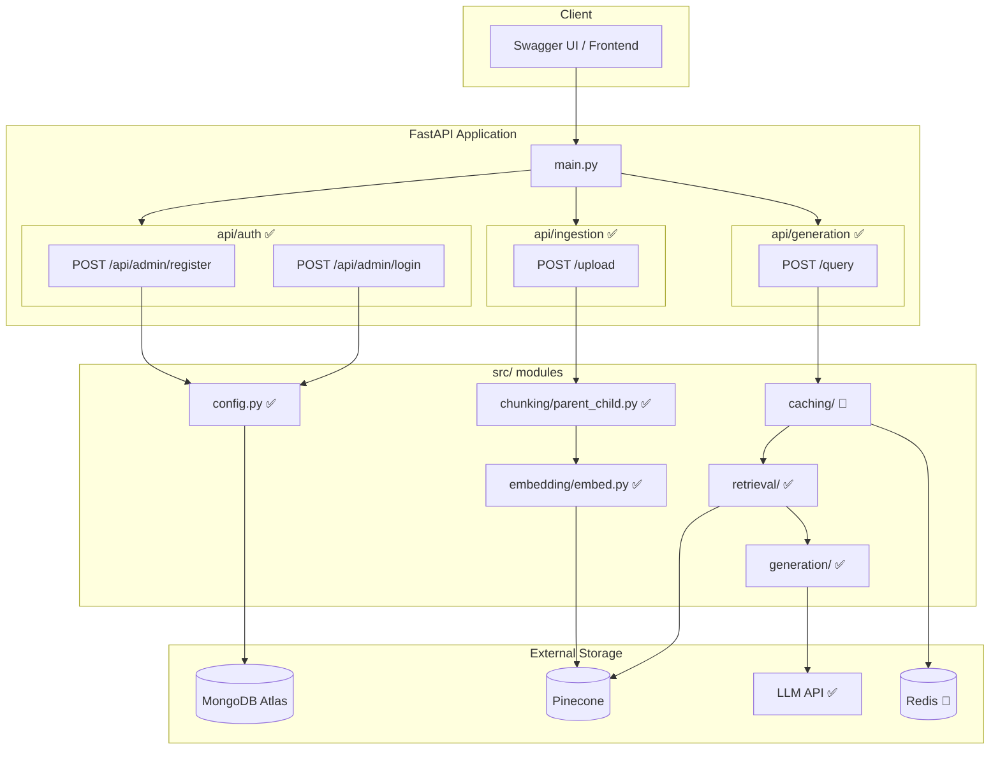

# devRAG — Retrieval-Augmented Generation System

A modular RAG system built with **FastAPI**, **MongoDB Atlas**, and **Pinecone** that supports user-authenticated document ingestion with parent-child chunking and namespace isolation.

## Architecture



## Features

| Feature | Status |
|---------|--------|
| User registration & login (MongoDB) | ✅ |
| JWT authentication (HTTPBearer) | ✅ |
| File upload (PDF, TXT) | ✅ |
| Parent-child document chunking | ✅ |
| Pinecone vector upsert with namespace isolation | ✅ |
| Duplicate document detection (SHA256) | ✅ |
| Multi-tier caching (Exact, Semantic, Retrieval) | 🔲 |
| Retrieval with optional reranking | ✅ |
| LLM-based answer generation (Groq) | ✅ |

## Tech Stack

- **API**: FastAPI + Uvicorn
- **Auth**: JWT (python-jose) + bcrypt
- **Database**: MongoDB Atlas (pymongo)
- **Vector Store**: Pinecone (llama-text-embed-v2)
- **Chunking**: LangChain RecursiveCharacterTextSplitter
- **Document Parsing**: PyMuPDF

## Quick Start

```bash
# 1. Clone & install
git clone <repo-url>
cd rag-project-2
pip install -r requirements.txt

# 2. Configure environment
cp .env.example .env
# Fill in your keys in .env:
# - CONNECTION_STRING (MongoDB)
# - SECRET_KEY (For JWT)
# - PINECONE_API_KEY
# - GROQ_API_KEY

# 3. Run the application
uvicorn main:app --reload

# 4. Open Swagger docs to test
# Go to http://localhost:8000/docs
```

### How to Test the Flow in Swagger:
1. **Register & Login:** Call `POST /api/admin/register` to create a user, then `POST /api/admin/login` to get your `access_token`.
2. **Authorize:** Click the 🔒 **Authorize** button at the top of Swagger and paste your token in the Value field.
3. **Upload Data:** Use `POST /upload` out to upload a PDF or TXT file. Wait for it to chunk and index in Pinecone.
4. **Query:** Use `POST /query` with a question that can be answered by your uploaded document. Set `rerank: true` if you want higher precision.

## Project Structure

```
├── main.py                  # FastAPI app entrypoint
├── api/
│   ├── auth/                # Registration & login endpoints
│   │   ├── route.py
│   │   ├── services.py
│   │   └── datamodels.py
│   └── ingestion/           # Document upload endpoint
│       ├── route.py
│       ├── services.py
│       └── datamodels.py
├── src/
│   ├── config.py            # All configuration (MongoDB, Pinecone, JWT)
│   ├── chunking/            # Parent-child chunking pipeline
│   ├── embedding/           # Pinecone index management & upsert
│   ├── caching/             # 🔲 Exact, semantic, retrieval caches
│   ├── retrieval/           # ✅ Retriever & reranker (Pinecone)
│   ├── generation/          # ✅ LLM answer generation (Groq)
│   └── database/            # 🔲 DB models & CRUD
└── docs/
    └── architecture.md      # Detailed architecture diagrams
```

## API Endpoints

| Method | Endpoint | Auth | Description |
|--------|----------|------|-------------|
| POST | `/api/admin/register` | No | Register a new user |
| POST | `/api/admin/login` | No | Login & get JWT token |
| POST | `/upload` | Bearer JWT | Upload & index a document |
| POST | `/query` | Bearer JWT | Ask questions based on uploaded docs |
| GET | `/` | No | Health check |