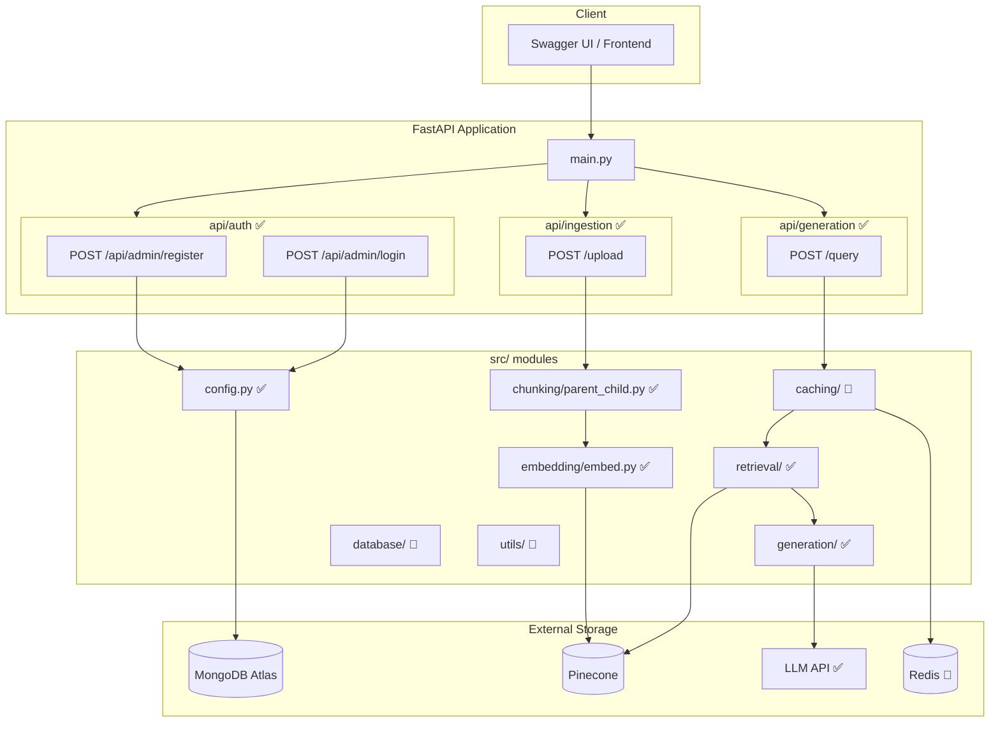
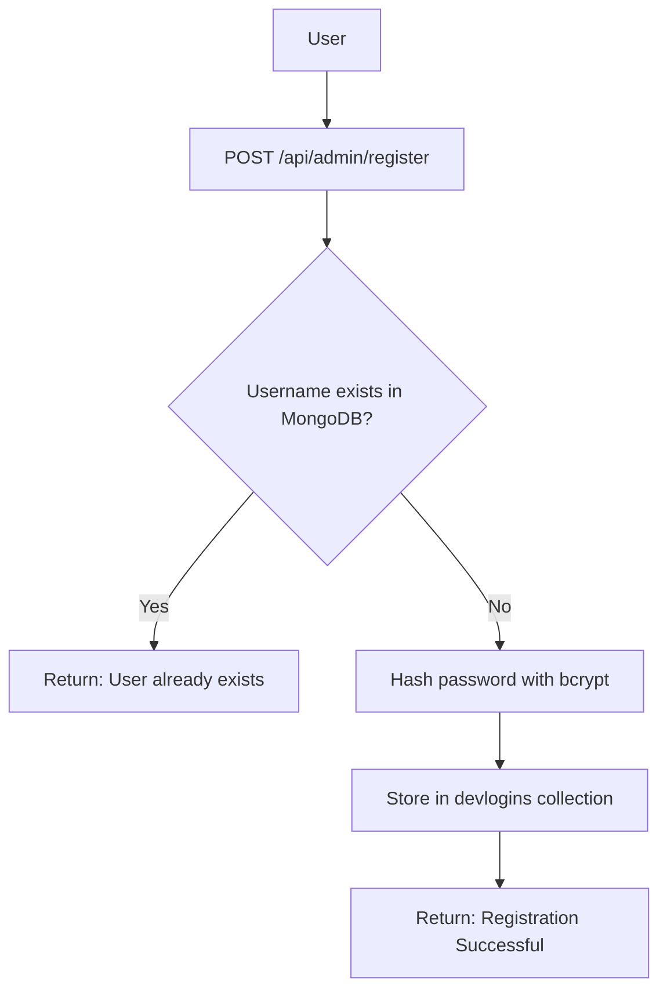
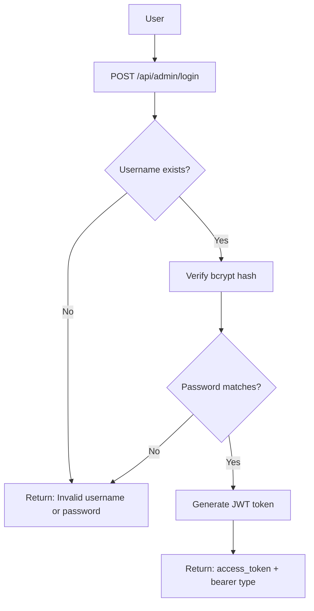
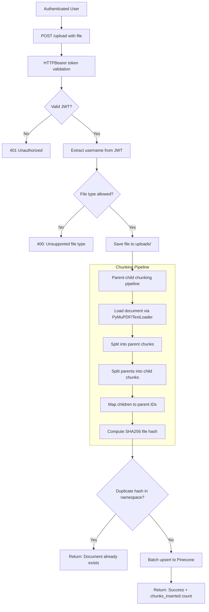
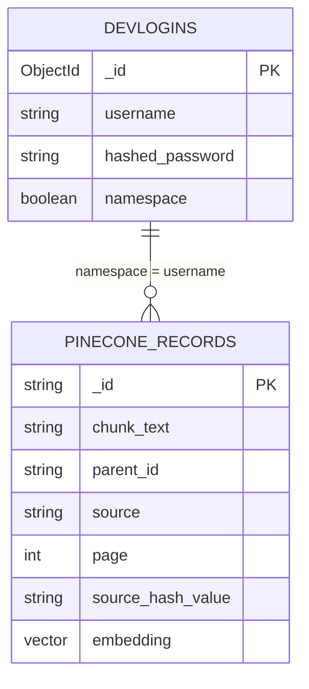

# Architecture Document

## Overview

This project implements a Retrieval-Augmented Generation (RAG) system with:

- ✅ User registration & login (MongoDB)
- ✅ JWT-based authentication (HTTPBearer)
- ✅ Namespace isolation in Pinecone (per-user)
- ✅ Parent-child document chunking
- ✅ Document ingestion with duplicate detection
- 🔲 Multi-tier caching (Exact, Semantic, Retrieval)
- ✅ Retrieval with optional reranking
- ✅ LLM-based answer generation

---

## System Architecture

---

# 1. User Registration ✅

**Implemented in:** `api/auth/route.py`, `api/auth/services.py`

---

# 2. User Login ✅

**Implemented in:** `api/auth/route.py`, `api/auth/services.py`
- Token expires in 24 hours
- Algorithm: HS256

---

# 3. Document Ingestion ✅

**Implemented in:** `api/ingestion/route.py`, `src/chunking/parent_child.py`, `src/embedding/embed.py`

### Chunking Details
| Parameter | Default |
|-----------|---------|
| Parent chunk size | 1000 |
| Parent chunk overlap | 200 |
| Child chunk size | 200 |
| Child chunk overlap | 20 |

### Pinecone Configuration
| Setting | Value |
|---------|-------|
| Index name | devrag |
| Embedding model | llama-text-embed-v2 |
| Cloud | AWS (us-east-1) |
| Batch size | 96 |

---

# 4. Query Pipeline ✅

```mermaid
flowchart TD
    A["User Query + Namespace"] --> B["Validate Request"]
    B --> C["Exact Cache - Tier 1"]
    C -->|Hit| D["Return Cached Answer"]
    C -->|Miss| E["Semantic Cache - Tier 2"]
    E -->|Hit| D
    E -->|Miss| F["Retrieval Cache - Tier 3"]
    F -->|Hit| D
    F -->|Miss| G{"Rerank Enabled?"}

    G -- Yes --> H["Retrieve + Rerank"]
    G -- No --> I["Retrieve Top-K"]

    H --> J["Build Context from Parent Chunks"]
    I --> J

    J --> K["Generate Answer via LLM"]
    K --> L["Store in Cache"]
    L --> D

    style C fill:#333,stroke:#888,stroke-dasharray: 5 5
    style E fill:#333,stroke:#888,stroke-dasharray: 5 5
    style F fill:#333,stroke:#888,stroke-dasharray: 5 5
    style L fill:#333,stroke:#888,stroke-dasharray: 5 5
```

---

# 5. Data Storage

### Storage Responsibilities

| Store | Technology | Status |
|-------|-----------|--------|
| User credentials | MongoDB Atlas (`devlogins`) | ✅ Implemented |
| Vector chunks | Pinecone (`devrag` index) | ✅ Implemented |
| Cached responses | Redis | 🔲 Planned |
| LLM generation | Groq API | ✅ Implemented |

---

# 6. Module Status

| Module | Files | Status |
|--------|-------|--------|
| `api/auth/` | route, services, datamodels | ✅ Implemented |
| `api/ingestion/` | route, services, datamodels | ✅ Implemented |
| `src/config.py` | MongoDB, Pinecone, JWT config | ✅ Implemented |
| `src/chunking/` | parent_child.py | ✅ Implemented |
| `src/embedding/` | embed.py | ✅ Implemented |
| `src/caching/` | exact_cache, semantic_cache, retrieval_cache | 🔲 Empty stubs |
| `src/retrieval/` | retriever, reranker | ✅ Implemented |
| `src/generation/` | generator | ✅ Implemented |
| `src/database/` | models, crud, connection | 🔲 Empty stubs |
| `src/utils/` | embeddings, logger | 🔲 Empty stubs |